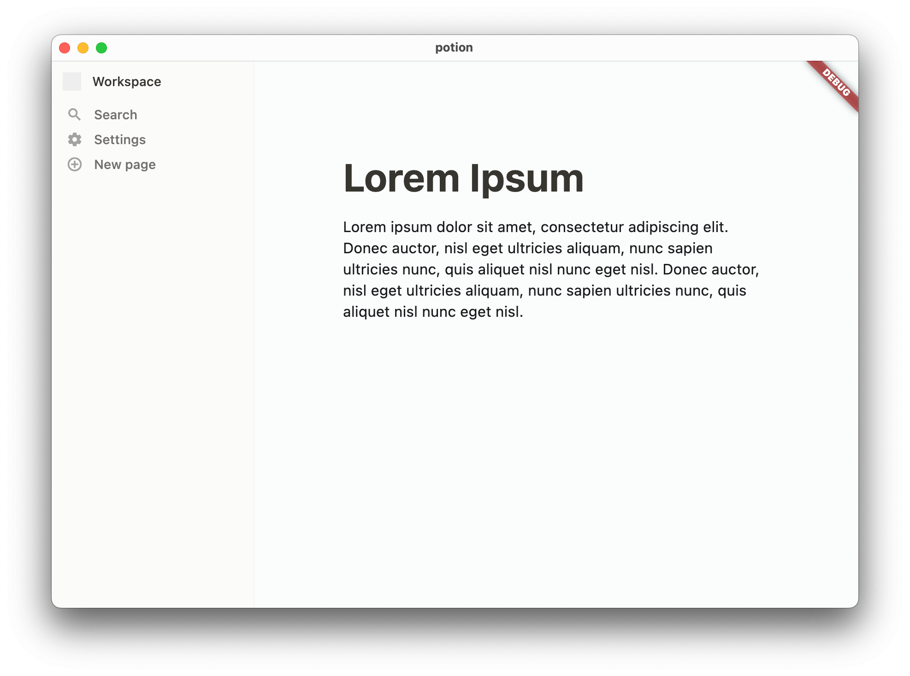

# Potion

An alternative Notion client written in Flutter.

## Why

Notion is an excellent note-taking tool, but its official client is subpar. It's slow, consumes excessive RAM, and is built on Electron. Potion, on the other hand, is a Flutter-based alternative client for Notion. It offers blazing-fast performance and closely resembles the official interface.